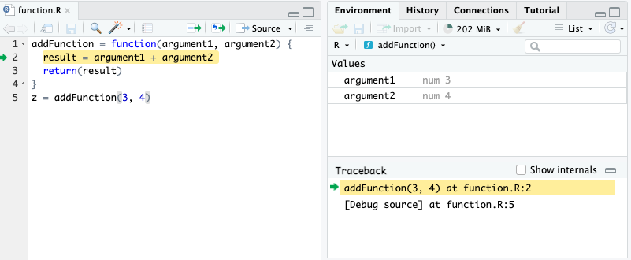
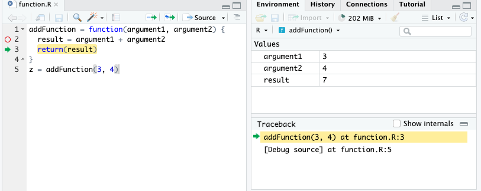
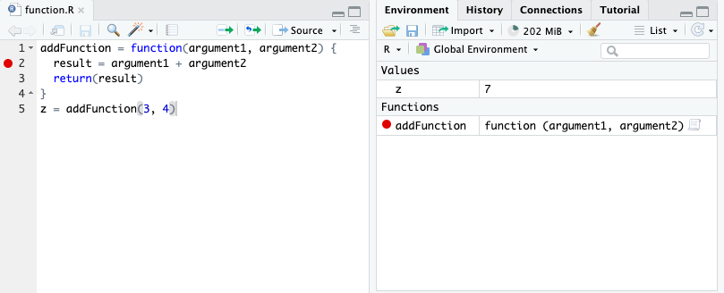
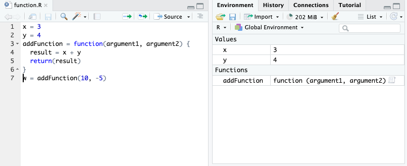
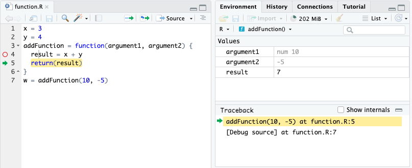

# Writing your first function


We write functions for two main, often overlapping, reasons:

1.  Following DRY (Don't Repeat Yourself) principle: If you find yourself repeating similar patterns of code, you should write a function that executes that pattern. This saves time and the risk of mistakes.

2.  Create modular structure and abstraction: Having all of your code in one place becomes increasingly complicated as your program grows. Think of the function as a mini-program that can perform without the rest of the program. Organizing your code by functions gives modular structure, as well as abstraction: you only need to know the function name, inputs, and output to use it and don't have to worry how it works.

Some advice on writing functions:

-   Code that has a well-defined set of inputs and outputs make a good function.

-   A function should do only one, well-defined task.

## Anatomy of a function definition

*Function definition consists of assigning a **function name** with a "function" statement that has a comma-separated list of named **function arguments**, and a **return expression**. The function name is stored as a variable in the global environment.*

In order to use the function, one defines or import it, then one calls it.

Example:

```         
addFunction = function(argument1, argument2) {
  result = argument1 + argument2 
  return(result)
}
z = addFunction(3, 4)
```

With function definitions, not all code runs from top to bottom. The first four lines defines the function, but the function is never run. It is called on line 5, and the lines within the function are executed.

When the function is called in line 5, the variables for the arguments are reassigned to function arguments to be used within the function and helps with the modular form. We need to introduce the concept of local and global environments to distinguish variables used only for a function from variables used for the entire program.

## Local and global environments

*{ } represents variable scoping: within each { }, if variables are defined, they are stored in a **local environment**, and is only accessible within { }. All function arguments are stored in the local environment. The overall environment of the program is called the **global environment** and can be also accessed within { }.*

The reason of having some of this "privacy" in the local environment is to make functions modular - they are independent little tools that should not interact with the rest of the global environment. Imagine someone writing a tool that they want to give someone else to use, but the tool depends on your environment, vice versa.

## A step-by-step example

Using the `addFunction` function, let's see step-by-step how the R interpreter understands our code:








## Function arguments create modularity

First time writers of functions might ask: why are variables we use for the arguments of a function *reassigned* for function arguments in the local environment? Here is an example when that process is skipped - what are the consequences?

```         
x = 3
y = 4
addFunction = function(argument1, argument2) {
    result = x + y 
    return(result)
}
z = addFunction(x, y)
w = addFunction(10, -5)
```

What do you expect the value of `z` to be? How about `w`?

Here is the execution for `w`:







The function did not work as expected because we used hard-coded variables from the global environment and not function argument variables unique to the function use!

## Examples

-   Create a function, called `add_and_raise_power` in which the function takes in 3 numeric arguments. The function computes the following: the first two arguments are added together and raised to a power determined by the 3rd argument. The function returns the resulting value. Here is a use case: `add_and_raise_power(1, 2, 3) = 27` because the function will return this expression: `(1 + 2) ^ 3`. Another use case: `add_and_raise_power(3, 1, 2) = 16` because of the expression `(3 + 1) ^ 2`. Confirm with that these use cases work. Can this function used for numeric vectors?

    
    ```r
    add_and_raise_power = function(x, y, z) {
      result = (x + y)^z
      return(result)
    }
    add_and_raise_power(1, 2, 3)
    ```
    
    ```
    ## [1] 27
    ```

-   Create a function, called `my_dim` in which the function takes in one argument: a dataframe. The function returns the following: a length-2 numeric vector in which the first element is the number of rows in the dataframe, and the second element is the number of columns in the dataframe. Your result should be identical as the `dim` function. How can you leverage existing functions such as `nrow` and `ncol`? Use case: `my_dim(penguins) = c(344, 8)`

    
    ```r
    library(palmerpenguins)
    my_dim = function(df) {
      result = c(nrow(df), ncol(df))
      return(result)
    }
    my_dim(penguins)
    ```
    
    ```
    ## [1] 344   8
    ```

-   Create a function, called `num_na` in which the function takes in any vector, and then return a single numeric value. This numeric value is the number of `NA`s in the vector. Use cases: `num_na(c(NA, 2, 3, 4, NA, 5)) = 2` and `num_na(c(2, 3, 4, 5)) = 0`. Hint 1: Use `is.na()` function. Hint 2: Given a logical vector, you can count the number of `TRUE` values by using `sum()`, such as `sum(c(TRUE, TRUE, FALSE)) = 2`.

    
    ```r
    num_na = function(x) {
      return(sum(is.na(num_na)))
    }
    ```

-   Create a function, called `medicaid_eligible` in which the function takes in one argument: a numeric vector called `age`. The function returns a numeric vector with the same length as `age`, in which elements are `0` for indicies that are less than 65 in `age`, and `1` for indicies 65 or higher in `age`. (Hint: This is a data recoding problem!) Use cases: `medicaid_eligible(c(30, 70)) = c(0, 1)`

    
    ```r
    medicaid_eligible = function(age) {
      result = age
      result[age < 65] = 0
      result[age >= 65] = 1
      return(result)
    }
    medicaid_eligible(c(30, 70))
    ```
    
    ```
    ## [1] 0 1
    ```

## Exercises

You can find [exercises and solutions on Posit Cloud](https://posit.cloud/content/8236252), or on [GitHub](https://github.com/fhdsl/Intermediate_R_Exercises).
