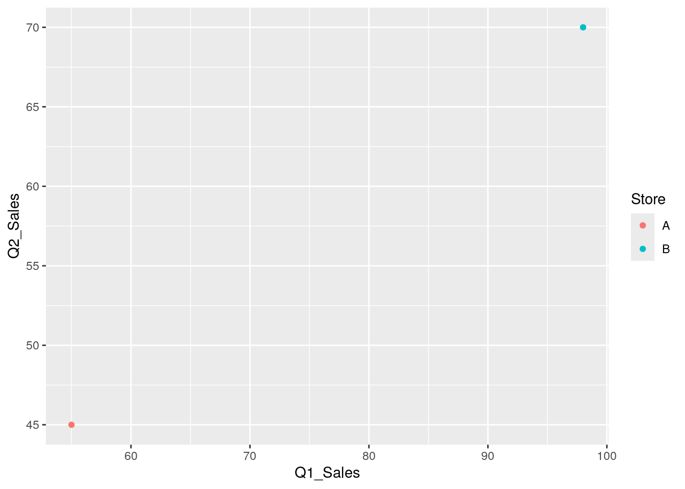
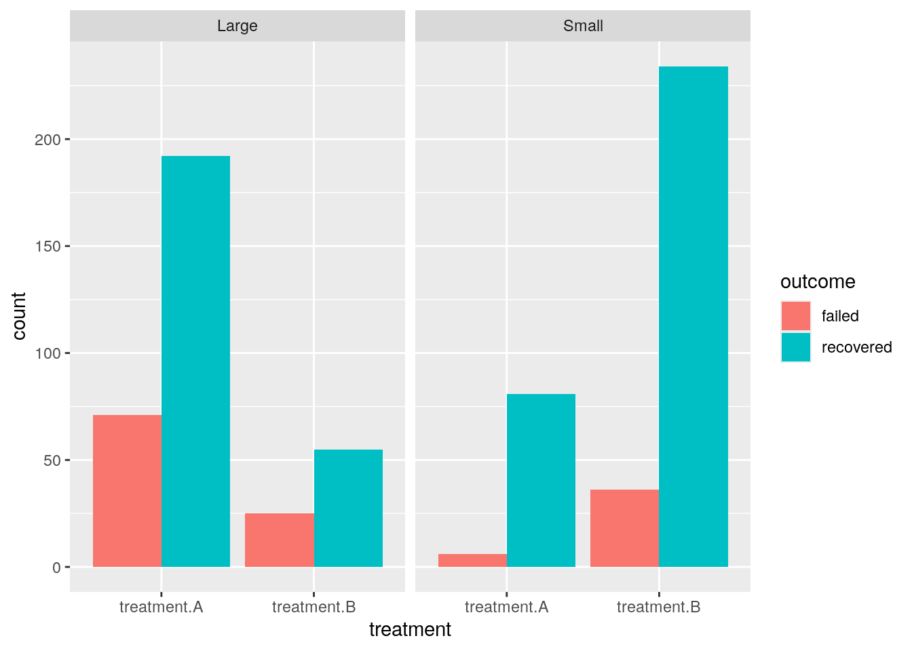

# Data Cleaning, Part 2


Another important data cleaning step is to make sure that the shape of the data is useful for the analysis. Today, we will learn about a data organizing standard called Tidy Data, and some common transformations of making a dataframe *longer* and *wider* to get there.

## Tidy Data

It is important to have standard of organizing data, as it facilitates a consistent way of thinking about data organization and building tools (functions) that make use of that standard. The [principles of **Tidy data**](https://vita.had.co.nz/papers/tidy-data.html), developed by Hadley Wickham:

1.  Each variable must have its own column.

2.  Each observation must have its own row.

3.  Each value must have its own cell.

If we want to be technical about what variables and observations are, Hadley Wickham describes:

> A dataset is a collection of **values**, usually either numbers (if quantitative) or strings (if qualitative). Every value belongs to a **variable** and an **observation**. A **variable** contains all values that measure the same underlying attribute (like height, temperature, duration) across units. An **observation** contains all values measured on the same unit (like a person, or a day, or a race) across attributes.

.](https://r4ds.hadley.nz/images/tidy-1.png){width="800"}

Besides a standard, Tidy data is useful because many tools in R are most effective when your data is in a Tidy format. This includes data visualization with ggplot, regression models, databases, and more.

At first glance, it seems hard to go wrong with these simple criteria of Tidy data! However, in reality, many dataframes we load in aren't Tidy, and it's easiest seen through counterexamples and how to fix it. Here are some common ways that data becomes un-Tidy:

1.  Columns contain values of variables, rather than variables

2.  Variables are stored in rows

3.  Multiple variables are stored in a single column

After some clear examples, we emphasize that "Tidy" data is *subjective* to what kind of analysis you want to do with the dataframe.

### 1. Columns contain values, rather than variables (Long is tidy)


``` r
df = data.frame(Store = c("A", "B"),
                Year = c(2018, 2018),
                Q1_Sales = c(55, 98),
                Q2_Sales = c(45, 70),
                Q3_Sales = c(22, 60),
                Q4_Sales = c(50, 60))
df
```

```
##   Store Year Q1_Sales Q2_Sales Q3_Sales Q4_Sales
## 1     A 2018       55       45       22       50
## 2     B 2018       98       70       60       60
```

Each observation is a store, and each observation has its own row. That looks good.

The columns "Q1_Sales", ..., "Q4_Sales" seem to be *values of a single variable "quarter"* of our observation. The values of "quarter" are not in a single column, but are instead in the columns.


``` r
df_long = pivot_longer(df, c("Q1_Sales", "Q2_Sales", "Q3_Sales", "Q4_Sales"), names_to = "quarter", values_to = "sales")
df_long
```

```
## # A tibble: 8 × 4
##   Store  Year quarter  sales
##   <chr> <dbl> <chr>    <dbl>
## 1 A      2018 Q1_Sales    55
## 2 A      2018 Q2_Sales    45
## 3 A      2018 Q3_Sales    22
## 4 A      2018 Q4_Sales    50
## 5 B      2018 Q1_Sales    98
## 6 B      2018 Q2_Sales    70
## 7 B      2018 Q3_Sales    60
## 8 B      2018 Q4_Sales    60
```

Now, each observation is a store's quarter, and each observation has its own row.

The new columns "quarter" and "sales" are variables that describes our observation, and describes our values. We're in a tidy state!

We have transformed our data to a "**longer**" format, as our observation represents something more granular or detailed than before. Often, the original variables values will repeat itself in a "longer format". We call the previous state of our dataframe is a "**wider**" format.

### 2. Variables are stored in rows (Wide is tidy)

Are all tidy dataframes Tidy in a "longer" format?


``` r
df2 = data.frame(Sample = c("A", "B"),
                 KRAS_mutation = c(TRUE, FALSE),
                 KRAS_expression = c(2.3, 3.9))
df2
```

```
##   Sample KRAS_mutation KRAS_expression
## 1      A          TRUE             2.3
## 2      B         FALSE             3.9
```

Each observation is a sample, and each observation has its own row. Looks good. Each variable has its own column, and no values are in columns.

What happens if we make it longer?


``` r
df2_long = pivot_longer(df2, c("KRAS_mutation", "KRAS_expression"), names_to = "gene", values_to = "values")
df2_long
```

```
## # A tibble: 4 × 3
##   Sample gene            values
##   <chr>  <chr>            <dbl>
## 1 A      KRAS_mutation      1  
## 2 A      KRAS_expression    2.3
## 3 B      KRAS_mutation      0  
## 4 B      KRAS_expression    3.9
```

Here, each observation is a sample's gene...type? The observation feels awkward because variables are stored in rows. Also, the column "values" contains multiple variable types: gene expression and mutation values that got coerced to numeric!

To make this dataframe wider,


``` r
df2_long_wide = pivot_wider(df2_long, names_from = "gene", values_from = "values") 
df2_long_wide$KRAS_mutation = as.logical(df2_long_wide$KRAS_mutation)
df2_long_wide
```

```
## # A tibble: 2 × 3
##   Sample KRAS_mutation KRAS_expression
##   <chr>  <lgl>                   <dbl>
## 1 A      TRUE                      2.3
## 2 B      FALSE                     3.9
```

We are back to our orignal form, and it was already Tidy.

### 3. Multiple variables are stored in a single column


``` r
table3
```

```
## # A tibble: 6 × 3
##   country      year rate             
##   <chr>       <dbl> <chr>            
## 1 Afghanistan  1999 745/19987071     
## 2 Afghanistan  2000 2666/20595360    
## 3 Brazil       1999 37737/172006362  
## 4 Brazil       2000 80488/174504898  
## 5 China        1999 212258/1272915272
## 6 China        2000 213766/1280428583
```

There seems to be two variables in the numerator and denominator of "rate" column. Let's separate it.


``` r
separate(table3, col = "rate", into = c("count", "population"), sep = "/")
```

```
## # A tibble: 6 × 4
##   country      year count  population
##   <chr>       <dbl> <chr>  <chr>     
## 1 Afghanistan  1999 745    19987071  
## 2 Afghanistan  2000 2666   20595360  
## 3 Brazil       1999 37737  172006362 
## 4 Brazil       2000 80488  174504898 
## 5 China        1999 212258 1272915272
## 6 China        2000 213766 1280428583
```

## Uses of Tidy data

In general, many functions for analysis and visualization in R assumes that the input dataframe is Tidy. These tools assumes the values of each variable fall in their own column vector. For instance, from our first example, we can compare sales across quarters and stores.


``` r
df_long
```

```
## # A tibble: 8 × 4
##   Store  Year quarter  sales
##   <chr> <dbl> <chr>    <dbl>
## 1 A      2018 Q1_Sales    55
## 2 A      2018 Q2_Sales    45
## 3 A      2018 Q3_Sales    22
## 4 A      2018 Q4_Sales    50
## 5 B      2018 Q1_Sales    98
## 6 B      2018 Q2_Sales    70
## 7 B      2018 Q3_Sales    60
## 8 B      2018 Q4_Sales    60
```


``` r
ggplot(df_long) + aes(x = quarter, y = sales, group = Store) + geom_point() + geom_line()
```


Although in its original state we can also look at sales between quarter, we can only look between two quarters at once. Tidy data encourages looking at data in the most granular scale.


``` r
ggplot(df) + aes(x = Q1_Sales, y = Q2_Sales, color = Store) + geom_point()
```



## Subjectivity in Tidy Data

We have looked at clear cases of when a dataset is Tidy. In reality, the Tidy state depends on what we call variables and observations. Consider this example, inspired by the following [blog post](https://kiwidamien.github.io/what-is-tidy-data.html) by Damien Martin.


``` r
kidney = data.frame(stone_size = c("Small", "Large"),
                    treatment.A_recovered = c(81, 192),
                    treatment.A_failed = c(6, 71),
                    treatment.B_recovered = c(234, 55),
                    treatment.B_failed = c(36, 25))
kidney
```

```
##   stone_size treatment.A_recovered treatment.A_failed treatment.B_recovered
## 1      Small                    81                  6                   234
## 2      Large                   192                 71                    55
##   treatment.B_failed
## 1                 36
## 2                 25
```

Right now, the `kidney` dataframe clearly has values of a variable in the column. Let's try to make it Tidy by making it into a longer form and separating out variables that are together in a column.


``` r
kidney_long = pivot_longer(kidney, c("treatment.A_recovered", "treatment.A_failed", "treatment.B_recovered", "treatment.B_failed"), names_to = "treatment_outcome", values_to = "count")

kidney_long = separate(kidney_long, "treatment_outcome", c("treatment", "outcome"), "_")

kidney_long
```

```
## # A tibble: 8 × 4
##   stone_size treatment   outcome   count
##   <chr>      <chr>       <chr>     <dbl>
## 1 Small      treatment.A recovered    81
## 2 Small      treatment.A failed        6
## 3 Small      treatment.B recovered   234
## 4 Small      treatment.B failed       36
## 5 Large      treatment.A recovered   192
## 6 Large      treatment.A failed       71
## 7 Large      treatment.B recovered    55
## 8 Large      treatment.B failed       25
```

Here, each observation is a kidney stone's treatment's outcome type, and each observation has its own row.

The column "count" describes our observation, and describes our values. This dataframe seems reasonably Tidy.

How about this?


``` r
kidney_long_still = pivot_wider(kidney_long, names_from = "outcome", values_from = "count")
kidney_long_still
```

```
## # A tibble: 4 × 4
##   stone_size treatment   recovered failed
##   <chr>      <chr>           <dbl>  <dbl>
## 1 Small      treatment.A        81      6
## 2 Small      treatment.B       234     36
## 3 Large      treatment.A       192     71
## 4 Large      treatment.B        55     25
```

Here, each observation is a kidney stone's treatment, and each observation has its own row.

The columns "recovered" and "failed" are variables that describes our observation, and describes its corresponding values. This dataframe seems reasonably Tidy, also.

The reason why both of these versions seem Tidy is that the columns "recovered" and "failed" can be interpreted as independent variables *and* values of the variable "treatment".

Ultimately, we decide which dataframe we prefer based on the analysis we want to do.

For instance, when our observation is about a kidney stone's treatment's outcome type, we compare it between outcome type, treatment, and stone size.


``` r
ggplot(kidney_long) + aes(x = treatment, y = count, fill = outcome) + geom_bar(position="dodge", stat="identity") + facet_wrap(~stone_size)
```



When our observation is about a kidney stone's treatment's, we compare a new variable *recovery rate* ( = recovered / (recovered + failed)) between treatment and stone size.


``` r
kidney_long_still = mutate(kidney_long_still, recovery_rate = recovered / (recovered + failed))
ggplot(kidney_long_still) + aes(x = treatment, y = recovery_rate, fill = stone_size) + geom_bar(position="dodge", stat="identity")
```


## Exercises

You can find [exercises and solutions on Posit Cloud](https://posit.cloud/content/8236252), or on [GitHub](https://github.com/fhdsl/Intermediate_R_Exercises).
