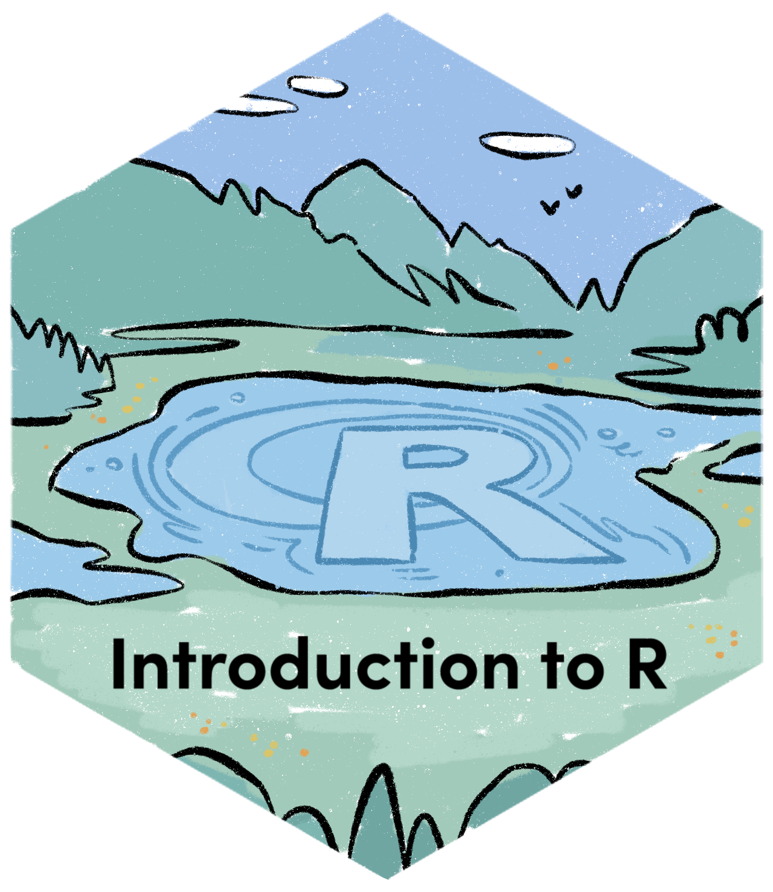
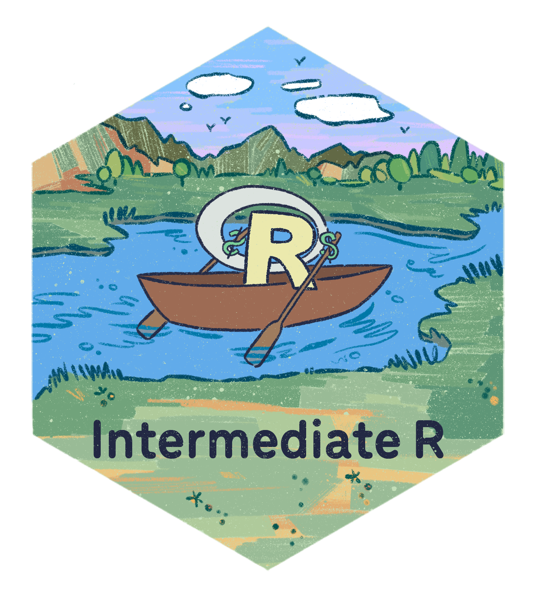

## Welcome!

{width="300"} {width="300"}

Please [sign-up for an account at Posit Cloud](https://login.posit.cloud/register) and accept our classroom invitation here: <https://posit.cloud/spaces/730482/join?access_code=IlSlAQYQvHY9ctbpACHT_aZgULxpskOcZTDzuan0>. 

## Introductions

-   Who am I?

. . .

-   What is [DaSL](https://ocdo.fredhutch.org/dasl/) / [OCDO](https://ocdo.fredhutch.org/) ?

. . .

-   Who are you?

    -   Name, pronouns, group you work in

    -   What brings you to this class?

    -   What has brought you joy lately?

. . .

-   Our wonderful TA!

## Goals of the course

. . .

-   Continue building **programming fundamentals**: *How to use complex data structures, use and create custom functions, and how to iterate repeated tasks.*

. . .

-   Continue exploration of **data science fundamentals**: *How to clean messy data to a Tidy form for analysis.*

. . .

-   At the end of the course, you will be able to: conduct a full analysis in the data science workflow (minus model).

    {width="550"}

## Culture of the course

. . .

-   Challenge: We are learning a new language, but you already have a full-time job.

. . .

-   *Teach not for mastery, but teach for empowerment to learn effectively.*

. . .

-   *Teach at learner's pace.*

## Culture of the course

-   Challenge: We sometimes struggle with our data science problems in isolation, unaware that other folks are working on similar things.

. . .

-   *We learn and work better with our peers.*

. . .

-   *We encourage discussion and questions, as others often have similar questions also.*

## Badge of completion

{width="400"}

We offer a [badge of completion](https://www.credly.com/org/fred-hutch/badge/intermediate-r) when you finish the course!

What it is:

-   A display of what you accomplished in the course, shareable in your professional networks such as LinkedIn, similar to online education services such as Coursera.

What it isn't:

-   Accreditation through an university or degree-granting program.

. . .

Requirements:

-   Complete badge-required sections of the exercises for 4 out of 5 assignments.

## Content of the course

1.  Fundamentals

. . .

2.  Data cleaning 1

. . .

3.  Data cleaning 2

. . .

4.  Writing your first function

. . .

5.  Repeating tasks

. . .

6.  Overflow/Celebratory lunch!!!

## Set up Posit Cloud and look at our workspace!

Please [sign-up for an account at Posit Cloud](#0 "https://login.posit.cloud/register") and accept our classroom invitation here: [https://posit.cloud/spaces/730482/join?access_code=IlSlAQYQvHY9ctbpACHT_aZgULxpskOcZTDzuan0](#0). 

## Data types in R

-   Numeric: 18, -21, 65, 1.25

. . .

-   Character: "ATCG", "Whatever", "948-293-0000"

. . .

-   Logical: TRUE, FALSE

. . .

-   Missing values: `NA`

## Data structures in R

-   Vector

. . .

-   Dataframe

. . .

-   List

## Vectors

A **vector** contains a data type, and all elements must be the same data type. We can have **logical vectors, numerical vectors**, etc.

. . .

Within the Numeric type that we are familiar with, there are more specific types: **Integer vectors** consists of whole number values, and **Double vectors** consists of decimal values.

## Testing and Coercing

We can test whether a vector is a certain type with `is.___()` functions, such as `is.character()`.

```{r}
is.character(c("hello", "there"))
```

. . .

For `NA`, the test will return a vector testing each element, because `NA` can be mixed into other values:

```{r}
is.na(c(34, NA))
```

. . .

We can **coerce** vectors from one type to the other with `as.___()` functions, such as `as.numeric()`

```{r}
as.numeric(c("23", "45"))
```

. . .

```{r}
as.numeric(c(TRUE, FALSE))
```

## Attributes of data structures

It is common to have metadata **attributes**, such as **names**, attached to R data structures.

```{r}
x = c(1, 2, 3)
names(x) = c("a", "b", "c")
x
```

. . .


. . .

```{r}
x["a"]
```

. . .

We can look for more general attributes via the `attributes()` function:

```{r}
attributes(x)
```

## Ways to subset a vector

```{r}
data = c(2, 4, -1, -3, 2, -1, 10)
```

. . .

1.  Positive numeric vector

    ```{r}
    data[c(1, 2, 7)]
    ```

. . .

2.  Negative numeric vector performs *exclusion*

    ```{r}
    data[-1]
    ```

. . .

3.  Logical vector

```{r}
data[c(TRUE, TRUE, FALSE, FALSE, FALSE, FALSE, TRUE)]
```

. . .

Comparison operators, such as `>`, `<=`, `==`, `!=`, create logical vectors for subsetting.

```{r}
data < 0
```

. . .

```{r}
data[data < 0]
```

## Review: Implicit Subsetting

1.  How do you subset the following vector so that it only has positive values?

```{r}
data = c(2, 4, -1, -3, 2, -1, 10)
```

. . .

2.  How do you subset the following vector so that it has doesn't have the character "temp"?

```{r}
chars = c("temp", "object", "temp", "wish", "bumblebee", "temp")
```

. . .

3.  Challenge: How do you subset the following vector so that it has no `NA` values?

```{r}
vec_with_NA = c(2, 4, NA, NA, 3, NA)
```

## Break

A pre-course survey: <https://forms.gle/xHW3vqv9gMvzCZh6A>

## Dataframes

Usually, we load in a dataframe from a spreadsheet or a package.

```{r, message=F, warning=F}
library(tidyverse)
library(palmerpenguins)
head(penguins)
```

. . .

Let's take a look at a dataframe's **attributes**.

```{r, message=F, warning=F}
attributes(penguins)
```

. . .

So, we can access the column names of the dataframe via `names()`:

```{r}
names(penguins)
```

## Review: Subsetting dataframes

*Subset to the single column `bill_length_mm`* *and compute its mean.*

. . .

*I want to select columns `bill_length_mm`, `bill_depth_mm`, `species`, and filter the rows so that `species` only has "Gentoo":*

. . .

*Challenge: I want to filter out rows that have `NA`s in the column `bill_length_mm`:*

## Lists

Lists operate similarly as vectors as they group data into one dimension, but each element of a list can be any data type *or data structure*!

```{r}
l1 = list(
  1:3, 
  "a", 
  c(TRUE, FALSE, TRUE), 
  c(2.3, 5.9)
)
```

. . .


. . .

Unlike vectors, you access the elements of a list via the double bracket `[[]]`. (You will access a smaller list with single bracket `[]`.)

```{r}
l1[[1]]
```

. . .

```{r}
l1[[1]][2]
```

## List names

We can give **names** to lists:

```{r}
l1 = list(
  ranking = 1:3, 
  name = "a", 
  success =  c(TRUE, FALSE, TRUE), 
  score = c(2.3, 5.9)
)
#or
names(l1) = c("ranking", "name", "success", "score")
```

. . .

And access named elements of lists via the `[[]]` or `$` operation:

```{r}
l1[["score"]]
l1$score
```

. . .

Therefore, `l1$score` is the same as `l1[[4]]` and is the same as `l1[["score"]]`.

. . .

What data structure does this remind you of?

## Dataframes as Lists

A dataframe is just a named list:

-   Each element is a vector of same length

-   **Attributes** of (column) `names`

. . .

```{r}
head(penguins)
```

. . .

```{r}
head(penguins[[3]])
head(penguins$bill_length_mm)
head(penguins[["bill_length_mm"]])
```

## How do you know what kind of data type a variable is?

```{r}
class(l1)
```

. . .

```{r}
class(penguins)
```
