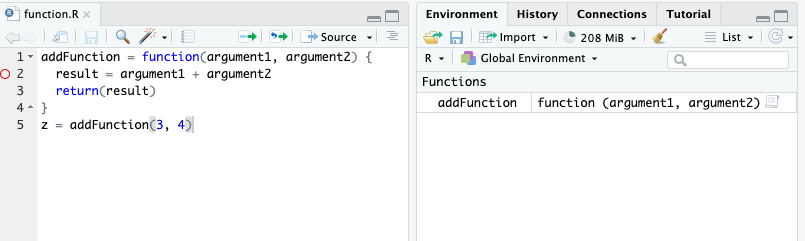
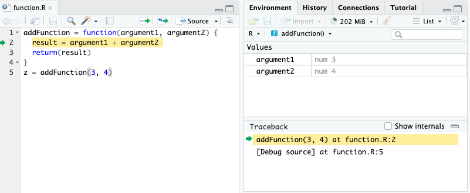
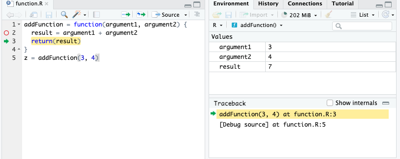
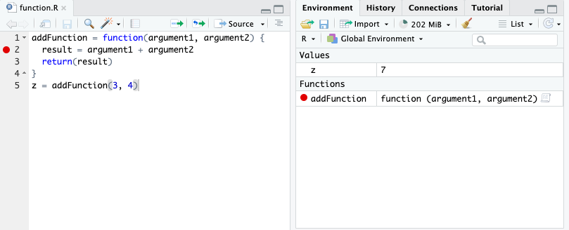

## Why functions?

. . .

We write functions for two main, often overlapping, reasons:

. . .

1.  Following DRY (Don't Repeat Yourself) principle

. . .

2.  Creates modular structure and abstraction

## Anatomy of a function definition

*Function definition consists of assigning a **function name** with a "function" statement that has a comma-separated list of named **function arguments**, and a **return expression**. The function name is stored as a variable in the global environment.*

. . .

```{r}
addFunction = function(argument1, argument2) {
  result = argument1 + argument2 
  return(result)
}
z = addFunction(3, 4)
z
```

. . .

With function definitions, not all code runs from top to bottom. The first four lines defines the function, but the function is never run. It is called on line 5, and the lines within the function are executed.

. . .

When the function is called in line 5, the variables are reassigned to function arguments to be used within the function and helps with the modular form.

## Local and global environments

*{ } represents variable scoping: within each { }, if variables are defined, they are stored in a **local environment**, and is only accessible within { }. All function arguments are stored in the local environment. The overall environment of the program is called the **global environment** and can be also accessed within { }.*

. . .

This "privacy" in the local environment is to make functions modular - they are independent tools that does not depend on the status of the global environment.

## Step-by-step example

Using the `addFunction` function, let's see step-by-step how the R interpreter understands our code:



## Step-by-step example



## Step-by-step example



## Step-by-step example



## Some function types we will consider

-   Inputs are single data types, output is a single data type

-   Inputs are vectors, outputs is a vector. Easy to use on a Dataframe.

-   Inputs are vectors, output is a single data type. Can be a summary statistic.

-   Inputs is a Dataframe, output is some metrics about it.

-   Inputs are filenames, or data processing settings, output is a Dataframe.

    -   Usually a pretty large function to process a Dataframe in a particular way.

## Your turn!

Create a function, called `add_and_multiply` in which the function takes in 3 numeric arguments. The function computes the following: the first two arguments are added together and multiplied by the 3rd argument. The function returns the resulting value.

Here is a use case: `add_and_multiply(1, 2, 3) = 9` because the function will return this expression: `(1 + 2) * 3`.

Another use case: `add_and_multiply(3, 1, 2) = 8` because of the expression `(3 + 1) * 2`. Confirm with that these use cases work.

What happens if you use it on the columns `bill_length_mm`, `bill_depth_mm`, and `body_mass_g` of `penguins` Dataframe? Can you store the result as a new column of `penguins`?

## Another exercise

Create a function, called `my_dim` in which the function takes in one argument: a dataframe. The function returns the following: a length-2 numeric vector in which the first element is the number of rows in the dataframe, and the second element is the number of columns in the dataframe. Your result should be identical as the `dim` function. How can you leverage existing functions such as `nrow` and `ncol`?

Use case: `my_dim(penguins) = c(344, 8)`

## If we have time

Create a function, called `num_na` in which the function takes in any vector, and then return a single numeric value. This numeric value is the number of `NA`s in the vector.

Use cases: `num_na(c(NA, 2, 3, 4, NA, 5)) = 2` and `num_na(c(2, 3, 4, 5)) = 0`.

Hint 1: Use `is.na()` function.

Hint 2: Given a logical vector, you can count the number of `TRUE` values by using `sum()`, such as `sum(c(TRUE, TRUE, FALSE)) = 2`.

This is an interesting use case of the function:

```         
penguins |> group_by(species) |> summarize(n_na_bill_length_mm = num_na(bill_length_mm))
```

## Appendix: Ways to call a function

```{r}
addFunction = function(num1, num2) {
    result = num1 + num2
    return(result)
}
```

. . .

```{r}
addFunction(3, 4)
```

. . .

```{r}
addFunction(num1 = 3, num2 = 4)
```

. . .

```{r}
addFunction(num2 = 4, num1 = 3)
```

. . .

But this *could* give a different result:

```{r}
addFunction(4, 3)
```

## 
