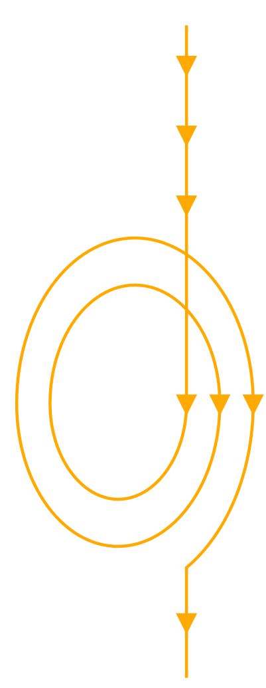
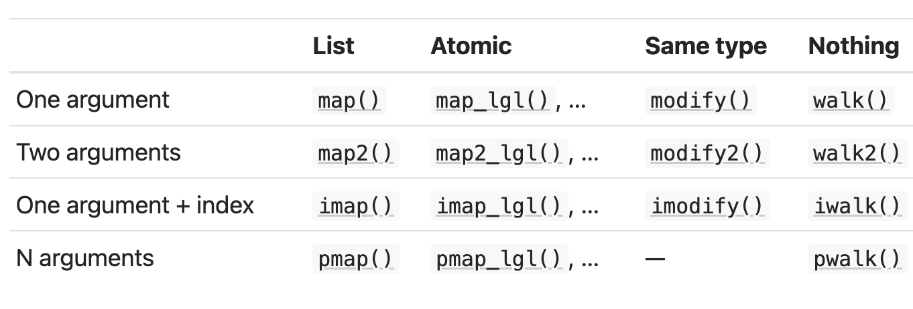

## Last class next week!

Wanna have lunch together? <https://forms.gle/Hki6HWszyk7Kq6nm9>

### Topics for last final class?

-   More practice?

-   Write a [cheatsheet](https://hutchdatascience.org/Intro_to_R/cheatsheet.html) together?

-   New topics?

## Iterating tasks

Suppose that you want to repeat a chunk of code many times, but changing one variable's value each time you do it: This could be modifying each element of a vector in the same way, or analyzing a dataframe multiple times with different parameters.

. . .

{width="200"}

{width="250"}

## Iterating tasks: solutions

1.  Copy and paste the code chunk, and change that variable's value. Repeat. *This can be a starting point in your analysis, but will lead to errors easily.*

. . .

2.  Use a `for` loop to repeat the chunk of code, and let it loop over the changing variable's value. *This is popular for many programming languages, but the R programming culture encourages a functional way instead*.

. . .

3.  **Functionals** (apply, map functions) allow you to take a function that solves the problem for a single input and generalize it to handle any number of inputs. *This is very popular in R programming culture.*

## Functionals

A **functional**, such as `map()`, is a function that takes in:

-   The data to be iterated over

-   The function that will be used on *one* element of the data

. . .

and applies the function on the data, element by element. It *maps* your input data structure to an output data structure based on the function.

. . .


. . .

{width="250"}

## Functionals via `map()`

`map()` takes in a vector or a list, and then applies the function on each element of it. The output is *always* a list.

```{r, warning=F, message=F, echo=FALSE}
library(tidyverse)
library(palmerpenguins)
```

```{r}
my_vector = c(1, 3, 5, 7)
result = map(my_vector, log)
result
```

. . .

```{r}
result[[1]]
```

. . .

Unlist it?

```{r}
unlist(result)
```

## Variations of `map()`

To be more specific about the output type, you can do this via the `map_*` function, where `*` specifies the output type: `map_lgl()`, `map_int()`, and `map_dbl()`, `map_chr()`functions return vectors of logical values, integer, double, or character, respectively.

{width="300"}

. . .

```{r}
map_dbl(my_vector, log)
```

## Case study 1: Iterate over filepaths to load them in

```{r}
paths = c("../classroom_data/students.csv", "../classroom_data/CCLE_metadata.csv")
```

Practice writing out the first iteration:

```{r, warning=FALSE, message=FALSE}
result = read_csv(paths[1])
```

. . .

To do this functionally, we think about:

. . .

-   Variable we need to loop through: `paths`

. . .

-   The repeated task as a function: `read_csv()`

. . .

-   The looping mechanism, and its output: `map()` outputs lists.

. . .

Here it is:

```{r, warning=F, message=F}
result = map(paths, read_csv)
```

## Case study 1: Iterate over filepaths to load them in

What if we want to do more than just `read_csv()` to load in the data? Perhaps we want to also remove all rows with missing values.

. . .

Practice writing out the first iteration:

```{r, warning=FALSE, message=FALSE}
read_df = read_csv(paths[1])
clean_df = drop_na(read_df)
```

. . .

We don't have a single function that can do both of these steps, so we have to write our own!

```{r}
load_and_remove_na = function(path) {
  read_df = read_csv(path)
  clean_df = drop_na(read_df)
  return(clean_df)
}
```

. . .

```{r}
result = map(paths, load_and_remove_na)
```

. . .

Alternatively, when the function is very short, we can write an in-line function:

```{r}
result = map(paths, function(path) drop_na(read_csv(path)))
```

## Case Study 2: Iterate over columns of a dataframe to get metrics

Suppose that you are interested in the numeric columns of the `penguins` dataframe, and you are interested to look at the mean of each column.

. . .

```{r}
penguins_numeric = penguins %>% select(bill_length_mm, bill_depth_mm, flipper_length_mm, body_mass_g)
head(penguins_numeric)
```

. . .

It is very helpful to interpret the dataframe `penguins_numeric` as a *list*, iterating through each column as an element of a list.

{width="300"}

. . .

Let's practice writing out one iteration:

```{r}
mean(penguins_numeric[[1]], na.rm = TRUE)
```

## Case Study 2: Iterate over columns of a dataframe to get summary statistics

To do this functionally, we think about:

. . .

-   Variable we need to loop through: the list `penguins_numeric`

. . .

-   The repeated task as a function: `mean()` with the argument `na.rm = TRUE`.

. . .

-   The looping mechanism, and its output: `map_dbl()` outputs (double) numeric vectors.

. . .

```{r}
map_dbl(penguins_numeric, mean, na.rm = TRUE)
```

## Case study 3: Iterate over different conditions to analyze a dataframe

Suppose you are working with the `penguins` dataframe:

```{r}
head(penguins)
```

. . .

and you want to look at the mean `bill_length_mm` for each of the three species (Adelie, Chinstrap, Gentoo).

. . .

Let's practice writing out one iteration:

```{r}
species_to_analyze = c("Adelie", "Chinstrap", "Gentoo")
#first iteration
penguins_subset = filter(penguins, species == species_to_analyze[1])
mean(penguins_subset$bill_length_mm, na.rm = TRUE)
```

## Case study 3: Analyze a dataframe with different parameters.

To do this functionally, we think about:

. . .

-   Variable we need to loop through: `c("Adelie", "Chinstrap", "Gentoo")`

. . .

-   The repeated task as a function: a custom function that takes in a specie of interest. The function filters the rows of `penguins` to the species of interest, and compute the mean of `bill_length_mm`.

. . .

-   The looping mechanism, and its output: `map_dbl()` outputs (double) numeric vectors.

. . .

```{r}
penguins_analysis = function(current_species) {
  penguins_subset = filter(penguins, species == current_species)
  result = mean(penguins_subset$bill_length_mm, na.rm=TRUE)
  return(result)
}
```

. . .

```{r}
map_dbl(c("Adelie", "Chinstrap", "Gentoo"), penguins_analysis)
```

. . .

-   Notice that our `penguins_analysis()` function reference a global variable `penguins` in its body! That's okay for the purpose of this function, but `penguins` will need to be defined for this function to be used.

-   Also notice that this analysis can be done using the `group_by()` `summarize()` functions. But this general pattern of analyzing your Dataframe using different parameters is useful for Functionals.

## Summary of case studies:

-   Case study 0:

    -   Input: Vector of numerics

    -   Function: numeric transformation

    -   Output: Vector of numerics

-   Case study 1:

    -   Input: Vector of parameters pointing to data

    -   Function: Load in data (& any other processing!)

    -   Output: List of Dataframes

-   Case study 2:

    -   Input: Columns of a Dataframe as a List of vectors,

    -   Function: Compute summary statistics

    -   Output: Vector of numerics

-   Case study 3:

    -   Input: Vector of parameters, dataframe of interest

    -   Function: Analysis on subset of the data

    -   Output: Vector of numerics

-   

## Map family of functions

{width="400"}

More info at: https://adv-r.hadley.nz/functionals.html

## For loops, briefly

A `for` loop repeats a chunk of code many times, once for each element of an input vector.

```         
for (my_element in my_vector) {
  chunk of code
}
```

Most often, the "chunk of code" will make use of `my_element`.

. . .

```{r}
my_vector = c(1, 3, 5, 7)
for (my_element in my_vector) {
  print(my_element)
}
```

## Loop through the indicies of a vector

```{r}
my_vector = c(1, 3, 5, 7)
seq_along(my_vector)
```

```{r}
for(i in seq_along(my_vector)) {
  print(my_vector[i])
}
```

. . .

```{r}
my_vector = c(1, 3, 5, 7)
result = rep(NA, length(my_vector))

for(i in seq_along(my_vector)) {
  result[i] = log(my_vector[i])
}

result
```

## Some suggestions

-   If there is a function that will do the entire iteration job, use that first. It will probably be much faster!

    -   ie. `log()` can be used on vectors already. No need to `map(x, log)`.

-   The speed performance of Functionals vs. Loops are generally similar. However, it is easy to write Loops that do not adhere to best practices, which slows them down.

    -   If you modify an *entire* data structure within the Loop, each modification may generate multiple copies of the data structure, which slows down the Loop.

    -   Similarly, you should avoid growing a data structure with Loops.

More details here: <https://github.com/fhdsl/R_Users_Group/blob/main/3_12_24_Loops_Vectorization/3_12_24_Loops_Vectorization.qmd>

More on functionals: <https://adv-r.hadley.nz/functionals.html>

More on iteration techniques in R: <https://r4ds.hadley.nz/iteration.html>
